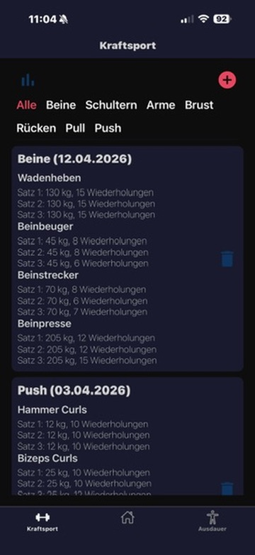
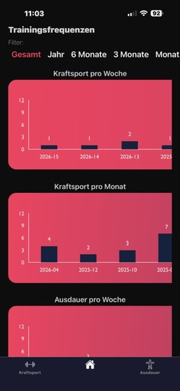
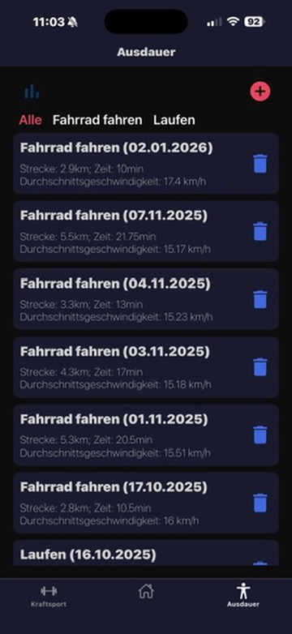

# SportTracker

SportTracker ist eine mobile Fitness-App zur Dokumentation und Auswertung von Kraftsport und Ausdauertraining.
Die App wird aktiv im Alltag genutzt sowie kontinuierlich weiterentwickelt.

  
  
  

## Funktionen

### Kraftsport

* Trainingsgruppen verwalten
* Übungen pro Trainingseinheit erfassen (z. B. Sätze, Wiederholungen, Gewicht)
* Trainingsdaten bearbeiten und historisch einsehen
* Statistische Auswertung von Fortschritten

### Ausdauer

* Ausdauer-Einträge anlegen
* Trainingsarten auswählen (z. B. Laufen, Radfahren)
* Dauer und weitere Daten erfassen
* Statistiken zur Entwicklung anzeigen

### Allgemein

* Modernes Navigationskonzept mit Tabs und Stacks
* Lokale Speicherung aller Daten (Offline-Nutzung möglich)
* Plattformübergreifend für iOS und Android

## Technologien

* React Native
* Expo
* TypeScript
* React Navigation
* Expo SQLite

## Motivation

Ziel war es, eine individuell angepasste Tracking-App zu entwickeln, die genau unseren Anforderungen entspricht.

Dieses Projekt legt bewusst den Fokus auf:

* einfache Bedienbarkeit im Alltag
* volle Kontrolle über die eigenen Daten
* iterative Weiterentwicklung basierend auf echter Nutzung

## Status

Die App ist aktiv im Einsatz und wird regelmäßig erweitert.
Neue Features und Bugfixes entstehen direkt aus der praktischen Nutzung.

## Learnings

* Entwicklung plattformübergreifender Mobile Apps mit React Native
* Strukturierung und persistente Speicherung von Daten mit SQLite
* Gestaltung von UI/UX für regelmäßige Nutzung im Alltag
* Umsetzung von Datenvisualisierung in mobilen Anwendungen
* Iterative Weiterentwicklung basierend auf realem Nutzerfeedback
## Hinweise

* Die App ist vollständig auf lokale Speicherung ausgelegt
* Kein Backend / keine Cloud-Anbindung

## Bekannte offene Punkte

Für bekannte Bugs und geplante Features siehe:
- `FeaturesAndBugs.md`
